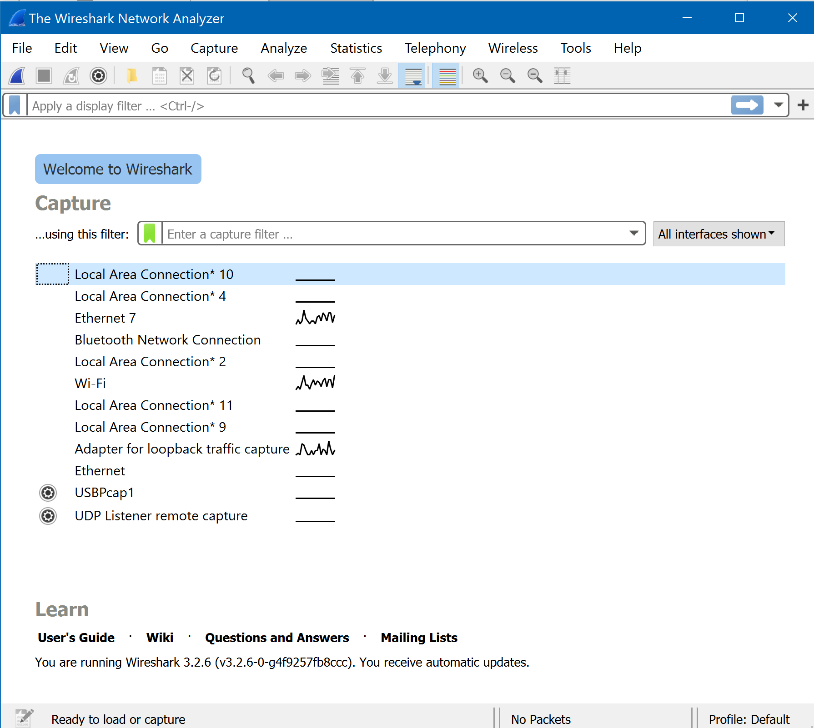
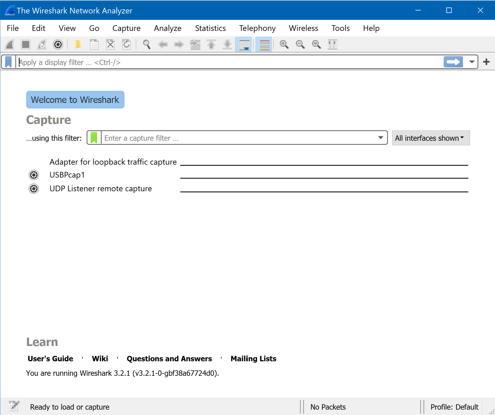
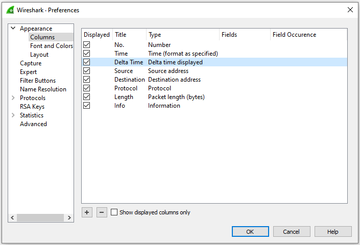
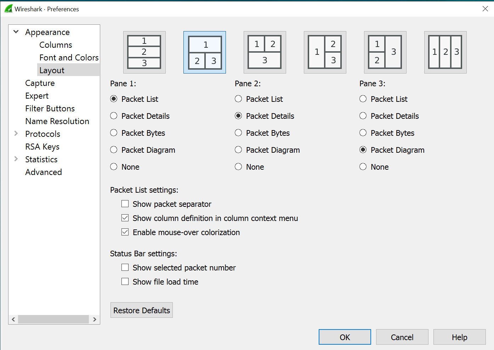
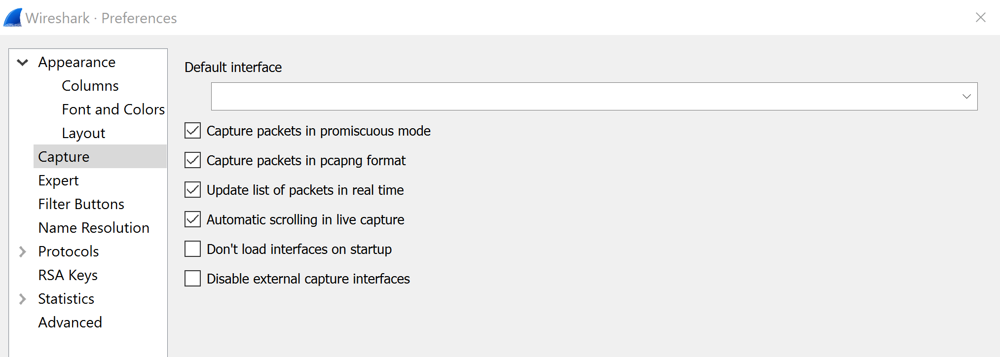
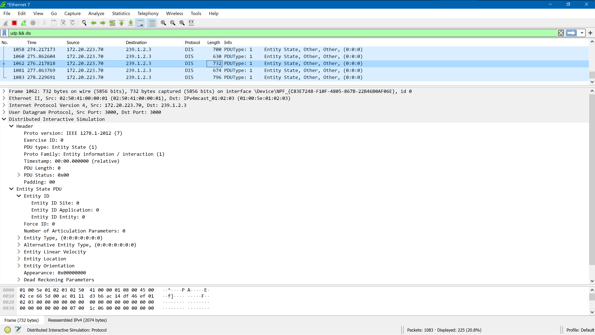
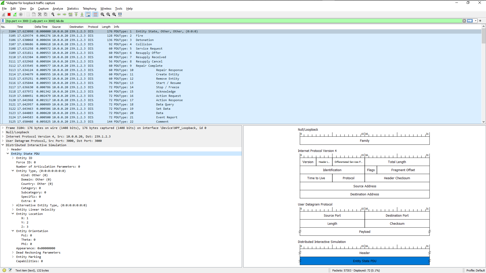

# Wireshark Setup and Usage 

> Wireshark is the world’s foremost and widely-used network protocol analyzer. 
> It lets you see what’s happening on your network at a microscopic level and 
> is the de facto (and often de jure) standard across many commercial and non-profit enterprises, 
> government agencies, and educational institutions. 
> Wireshark development thrives thanks to the volunteer contributions of networking experts 
> around the globe and is the continuation of a project started by Gerald Combs in 1998.

[Wireshark](https://www.wireshark.org) is an excellent open-source tool with wide use.
Capabilities include inspection of <code><b>dis</b></code> packets.

[Capturing DIS Packets](Capturing_DIS_Packets.pdf) by Tobias Brennenstuhl is his
[thesis annex](https://calhoun.nps.edu/handle/10945/65436)
specifically written to help support student efforts.

## Installation and Configuration

IMPORTANT: if you have already installed Wireshark, check your version!  
Always use the latest version so that operating-system security and feature sets are up to date.

1. Download Wireshark from https://www.wireshark.org
2. Install Wireshark using local administrator permissions if possible.
3. Launch and see if network packets are being detected.

| Successful installation, monitoring network traffic | Failed installation, no monitoring of network traffic |
| ------ | ------ |
|  |  |

4. Check your network interfaces via console commands [ipconfig](ipconfig.txt).
5. Double-check network interfaces using [ipconfig /all](ipconfigAllExcerpt.txt) to see any hidden interfaces.
6. Select blue "fin" Wireshark button in  header bar to begin monitoring packets.

## Capturing Packets

1. Adjust Wireshark Preferences as shown

| Edit &gt; Preferences &gt; Appearance &gt; Columns | Edit &gt; Preferences &gt; Appearance &gt; Layout |
| ------ | ------ |
| <a href="images/WiresharkPreferencesAppearanceColumns.png"> | <a href="images/WiresharkPreferencesAppearanceLayout.png"> |

| Edit &gt; Preferences &gt; Capture | |
| ------ | ------ |
| <a href="images/WiresharkPreferencesCapture.png"> | |

2. Set filter to `(tcp.port == 3000 || udp.port == 3000) && dis`
3. Launch one of the example programs to send packets, then observe results.

| `udp && dis` | `(tcp.port == 3000 \|\| udp.port == 3000) && dis` |
| ------ | ------ |
| <a href="images/WiresharkUdpDisPduCapture1.png"> | <a href="images/WiresharkUdpDisPduCapture2.png"> |

## References

1. [Wireshark home page](https://www.wireshark.org) and [Learning Wireshark](https://www.wireshark.org/#learnWS)
2. [Wireshark User’s Guide](https://www.wireshark.org/docs/wsug_html_chunked)
3. [Wireshark Frequently Asked Questions (FAQ)](https://www.wireshark.org/faq.html) and [Ask Wireshark](https://ask.wireshark.org/questions)
4. [NPS Remote Access and Wireless Services](https://nps.edu/web/technology/remote-access)
5. Tobias Brennenstuhl, [REPEATABLE UNIT TESTING OF DISTRIBUTED INTERACTIVE SIMULATION (DIS) PROTOCOL BEHAVIOR STREAMS USING WEB STANDARDS](https://calhoun.nps.edu/handle/10945/65436), MOVES Masters Thesis, Naval Postgraduate School (NPS), Monterey California USA, June 2020.

## Troubleshooting

1. Check [firewall settings](Firewall_Configuration.pdf) on your local system.  (Again thanks to Tobias for another helpful reference.)
2. Compare Wireshark results with/without your [Virtual Private Network (VPN)](https://en.wikipedia.org/wiki/Virtual_private_network) active. 
3. Compare Wireshark results when logged in as local administrator, if possible.
4. [StackOverflow: wireshark](https://stackoverflow.com/search?q=wireshark) is an excellent resource for detailed technical questions, looking up error messages, etc.

## Videos

1. [Wireshark Master Class // Lesson 1 // Wireshark Setup](https://www.youtube.com/watch?v=OU-A2EmVrKQ&t=358) by Packet Head Chris Greer
2. [Intro to Wireshark: Basics + Packet Analysis!](https://www.youtube.com/watch?v=jvuiI1Leg6w) by SinnohStarly - Ross Teixeira.
3. [Wireshark Tutorial for Beginners](https://www.youtube.com/watch?v=TkCSr30UojM) by Anson Alexander
4. [Back to Basics](https://www.youtube.com/watch?v=y13zH-8OPE8&t=9s) video by Hansang Bae.  "Read.... READ I SAY!!!!"
