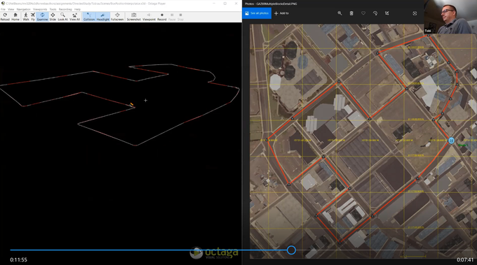

# REPEATABLE UNIT TESTING OF DISTRIBUTED INTERACTIVE SIMULATION (DIS) PROTOCOL BEHAVIOR STREAMS USING WEB STANDARDS

##  Tobias Brennenstuhl Lieutenant Colonel, German Army

### Masters Thesis, Modeling Virtual Environments Simulation (MOVES), Naval Postgraduate School (NPS), Monterey California USA, June 2020 

* [Presentation](BrennenstuhlOpenDIS7UnitTestingBriefingJune2020.pptx), [Thesis](BrennenstuhlOpenDIS7UnitTestingThesisJune2020.pdf), [Demonstration Video](BrennenstuhlOpenDIS7UnitTestingX3dInterpolation.mp4), [Twitter](https://twitter.com/Web3DConsortium/status/1283506818262552577), [YouTube](https://youtu.be/B_ARFsRFgRk)

Abstract. The IEEE Distributed Interactive Simulation (DIS) protocol is used for
high-fidelity real-time information sharing among simulations and trainers
across the entire international Modeling and Simulation (M&S) community.
If archivally saved and replayed, DIS streams have the potential to become
a valuable source of Big Data. The availability of archived prerecorded
behavior streams for replay, adaptation, and analysis can benefit an
immense variety of application areas. The computer science principle
"a stream is a stream" indicates that data in motion is equivalent to data at rest.
This characteristic can enable powerful capabilities for DIS.

This thesis presents prototypes to demonstrate how various forms of repeatability
are key to gaining improved benefits from DIS stream analysis. Unit testing of
DIS behavior streams allows confirmation of both repeatability and correctness
when testing all manner of applications, exercises, simulations, and
training sessions. A related use case is automated after-action review (AAR)
from recorded DIS streams. This thesis also shows how a DIS stream is converted
into autogenerated code that can animate an X3D Graphics model. Many obstacles
were overcome during this work, and so various best practices are provided.
Of note is that unit testing might even become a contract requirement for
incrementally developing and stably maintaining Live Virtual Constructive (LVC)
code bases. This progress provides many opportunities for future work.
