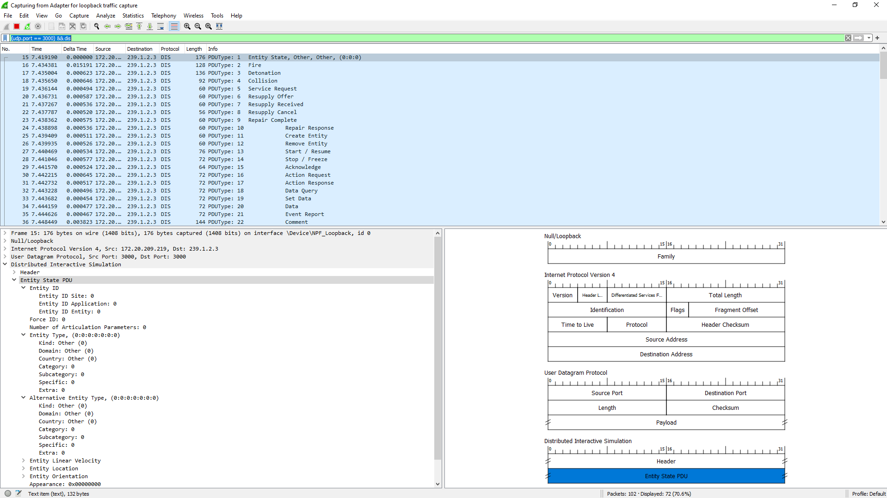
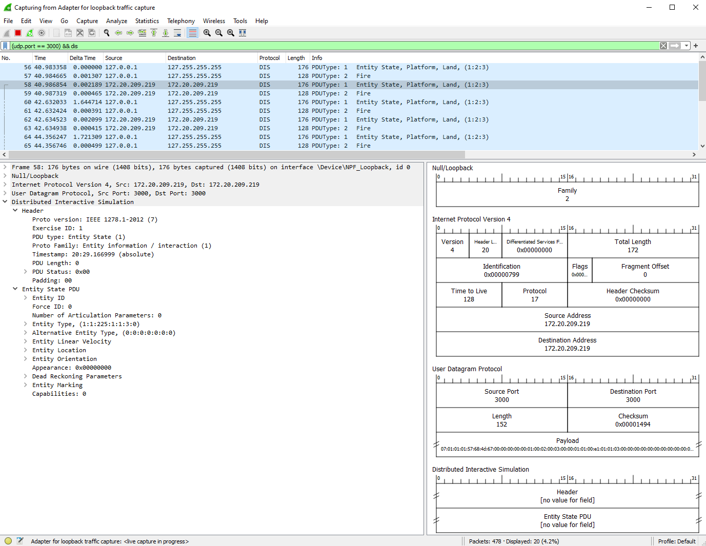
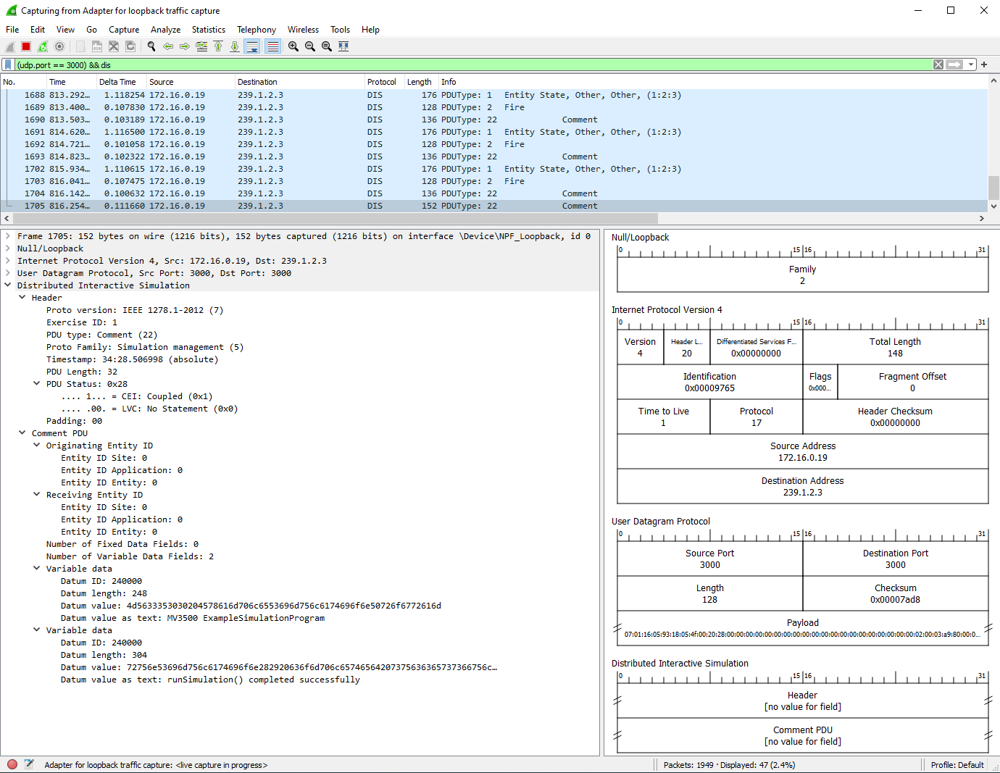
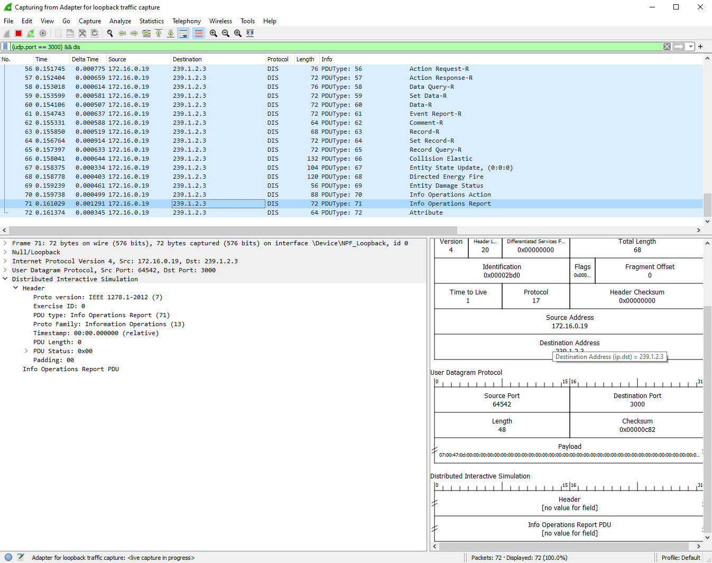

# DIS Protocol Examples using opendis7-java

These examples illustrate use of latest opendis7-java library for IEEE Distributed Interactive Simulation (DIS) Protocol.

<!-- View this page at https://github.com/open-dis/opendis7-java/tree/master/src/edu/nps/moves/dis7/examples/README.md -->

All examples are tested, running and documented satisfactorily.

This package presents course examples using the [Open-DIS-Java](https://github.com/open-dis/opendis7-java) library, with online [Javadoc](https://savage.nps.edu/opendis7-java/javadoc) showing complete coverage of 72 DIS PDUs and 22,000+ enumerations.

See the [specifications](../../../specifications) directory for guidance on obtaining reference copies of DIS and RPRFOM standards.

|  AllPduSender packets in Wireshark   |EspduSender packets in Wireshark  |
|--------------------------------------|----------------------------------|
|   |  |

| Example Simulation Program packets in Wireshark | PduReaderPlayer in Wireshark |
|-------------------------------------------------|------------------------------|
|  |  |